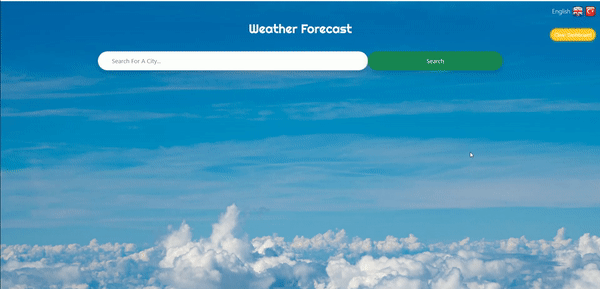

<h1 align="center">Weather Forecast</h1>

<div align="center">
  <h3>
    <a href="https://weather-app1098.netlify.app/">
      Live Demo
    </a>
 
  </h3>
</div>

<!-- TABLE OF CONTENTS -->

## Table of Contents

- [Overview](#overview)
- [Built With](#built-with)
- [Features](#features)
- [How to use](#how-to-use)
- [Contact](#contact)

<!-- OVERVIEW -->

## Overview



## Built With

<!-- This section should list any major frameworks that you built your project using. Here are a few examples.-->

- HTML
- CSS
- Javascript


## Features

- Vanilla JS Weather Forecast

## How To Use

<!-- This is an example, please update according to your application -->

To clone and run this application, you'll need [Git](https://git-scm.com)

```bash
# Clone this repository
$ git clone https://github.com/erol1098/Weather-App-JS.git

# Install dependencies
    $ yarn

# Add .env file for API Keys

# Run the app
    $ yarn start
```

## Contact

- GitHub [erol1098](https://github.com/erol1098)
- Linkedin [Erol Mahmutoglu](https://www.linkedin.com/in/erol-mahmutoglu/)
